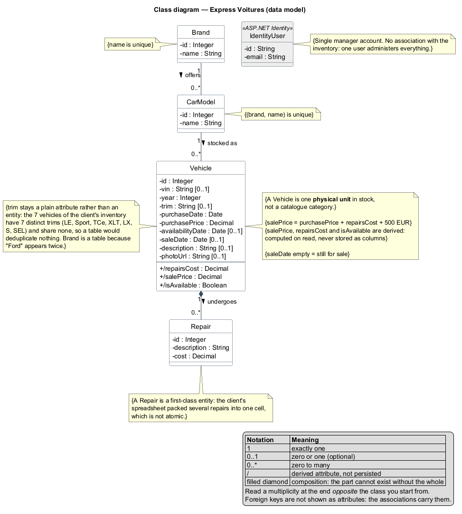

# Express Voitures

Prototype de site pour un concessionnaire indépendant. Le gérant achète des voitures aux enchères, les répare et les revend. Le site publie son inventaire et lui donne un back-office pour le tenir à jour.

Projet réalisé dans le cadre du parcours Développeur d'application .NET d'OpenClassrooms.

---

## Lancer le projet

Prérequis : **Visual Studio 2022 ou plus récent avec la charge de travail ASP.NET**, qui installe le SDK .NET 10 et SQL Server LocalDB.

```bash
git clone https://github.com/diasantoine/P5.git
```

Ouvrir `P5.slnx`, puis **F5**.

C'est tout. Au premier démarrage, l'application crée la base, applique les migrations, insère l'inventaire de départ et crée le compte du gérant. **Aucune commande à taper.**

En ligne de commande :

```bash
cd P5
dotnet run --launch-profile https
```

### Se connecter

| Champ | Valeur |
|---|---|
| Adresse e-mail | `jacques@expressvoitures.fr` |
| Mot de passe | `ExpressVoitures2026!` |

Ces identifiants sont des **valeurs de démonstration**, volontairement versionnées dans `P5/appsettings.json` pour qu'un évaluateur puisse se connecter sans configuration. Le site n'est pas destiné à être mis en ligne. Pour les remplacer sans toucher au dépôt :

```bash
cd P5
dotnet user-secrets set "AdminAccount:Password" "<votre mot de passe>"
```

L'inscription est ouverte à tous depuis le lien « S'inscrire », mais un compte créé ainsi ne reçoit aucun rôle : il consulte le site comme un visiteur. Seul le compte du gérant, créé au démarrage, porte le rôle `Admin`, et seul ce rôle peut modifier quoi que ce soit.

### Lancer les tests

```bash
dotnet test
```

58 tests. Ils couvrent la règle métier sur les sept lignes de l'inventaire du client, la configuration de la base, le comportement du seed, celui des services, et la restriction de toute écriture au rôle du gérant.

---

## Ce que le site fait

| Qui | Ce qu'il peut faire |
|---|---|
| Tout le monde, inscrit ou non | consulter l'inventaire et la fiche d'un véhicule, avec le prix de vente ; créer un compte et se connecter |
| Le gérant, connecté (rôle `Admin`) | ajouter un véhicule, modifier une annonce, saisir et supprimer des réparations, marquer un véhicule comme vendu, supprimer une annonce |

Le prix d'achat, le coût des réparations et la marge ne sont visibles que par le gérant : ce sont des informations internes.

### La règle de prix

```
Prix de vente = Prix d'achat + Coût des réparations + Marge
```

Le prix de vente **n'est jamais saisi ni stocké**. Il est recalculé à chaque lecture, donc il reste juste quand une réparation est ajoutée après coup. La marge vaut 500 € et se règle dans la section `Pricing` de `P5/appsettings.json`, sans recompiler.

---

## Modèle de données



Six entités. Le catalogue est une hiérarchie à trois niveaux, **marque → modèle → finition**, et une table de spécification porte le triplet complet. Un véhicule ne référence que cette spécification : il atteint donc sa marque en une seule jointure, au lieu de traverser toute la chaîne.

Deux clés étrangères **composites** garantissent la cohérence du triplet : la base refuse une spécification associant une marque à un modèle qui ne lui appartient pas.

Le diagramme des couches applicatives est dans [`docs/uml/architecture.png`](docs/uml/architecture.png), et les conventions de notation sont expliquées dans [`docs/uml/README.md`](docs/uml/README.md).

---

## Architecture

```
P5/
  Models/          les six entités persistées
  Data/            DbContext, migrations, seed de l'inventaire et du compte gérant
  Services/        toute la logique d'accès aux données, derrière des interfaces
  ViewModels/      les seules surfaces exposées aux formulaires
  Controllers/     aiguillage HTTP, sans aucune connaissance d'Entity Framework
  Views/           rendu Razor
  Configuration/   options de tarification
P5.Tests/          tests xUnit
docs/uml/          diagrammes de classes
docs/maquettes/    maquettes de référence
```

Trois principes structurent le code.

**Les contrôleurs ne connaissent pas la base.** Ils parlent à `IVehicleService` et `IRepairService`. Les chargements de données nécessaires au calcul du prix sont centralisés dans le service, donc impossibles à oublier.

**Les formulaires passent par des ViewModels.** Ils ne contiennent que les champs saisissables. La date de vente et les valeurs calculées n'y figurent pas et ne peuvent donc pas être envoyées par une requête forgée.

**Fermé par défaut.** Le contrôleur des véhicules porte `[Authorize]`, et seules la liste et la fiche sont ouvertes explicitement. Toute action qui modifie l'état passe par un POST avec jeton anti-CSRF.

---

## Base de données

SQL Server LocalDB, `(localdb)\mssqllocaldb`. La chaîne de connexion est dans `P5/appsettings.json`.

Le schéma est généré par **Entity Framework Core en Code First** : les classes C# font foi, les migrations en découlent. Pour repartir d'une base vierge :

```bash
cd P5
dotnet ef database drop
```

puis relancer l'application, qui la recrée et la remplit.

Les données de départ sont les sept véhicules transmis par le client. Elles ne sont insérées que si la base est vide : une base déjà remplie n'est jamais écrasée.

---

## Limites connues de ce prototype

- **Le catalogue ne s'enrichit pas depuis le site.** Les marques, modèles et finitions proposés sont ceux des données de départ. Ajouter un véhicule d'un modèle absent demande une évolution du formulaire.
- **L'envoi de photo n'est pas implémenté.** Le champ attend une URL.
- **L'habillage graphique** suit le gabarit Bootstrap par défaut ; l'intégration des maquettes reste à faire.
- Le site n'est pas prévu pour être mis en ligne : identifiants de démonstration versionnés, pas d'envoi d'e-mail, pas de compte utilisateur public.
